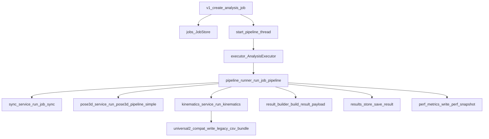

# 后端 README（架构、流程、CSV 与前后端对接）

## 1. 后端总体设计

后端由 `web_1/v1.py` 作为统一入口，负责：

- 提供前端页面与静态资源
- 接收分析任务请求
- 异步执行分析流水线
- 提供任务状态、结果与产物下载接口

视频分析采用“路由层 -> 任务层 -> 编排层 -> 阶段服务层 -> 结果聚合层”的分层设计。

---

## 2. API 与数据校验约定

- **JSON 请求体**：优先 `request.get_json(silent=True)`，对 `None` 或非 `dict` 返回 `400` + `{"ok": false, "error": "..."}`，避免未捕获异常。
- **成功响应**：业务成功时统一带 `"ok": true`，载荷字段随接口而定。
- **失败响应**：`"ok": false` 与稳定 `error` 字符串，便于前端分支与日志检索。
- **查询参数**：在路由内做存在性/类型校验；文件上传校验扩展名与大小（见 `v1.py` 各路由）。

---

## 3. 后端结构与文件职责

```text
web_1/
├─ v1.py                                  # Flask 路由入口与全局对象初始化
└─ backend/
   ├─ hardware/
   │  └─ scripts/hardware/start_signal.py # 串口硬件触发（软失败，不阻断主流程）
   └─ analysis/
      ├─ jobs.py                          # JobStore：任务状态、目录、meta/log
      ├─ executor.py                      # AnalysisExecutor：线程池与队列
      ├─ pipeline_runner.py               # 主编排（sync -> pose3d -> kinematics -> result）
      ├─ sync_service.py                  # 对接 video_sync
      ├─ pose3d_service.py                # 对接 pose3d_project_2.0_fixed
      ├─ kinematics_service.py            # 对接 footwork_kinematics_universal2
      ├─ universal2_compat.py             # 统一导出 4 份 legacy CSV
      ├─ result_builder.py                # CSV/XLSX 聚合成前端 JSON
      ├─ results_store.py                 # 历史结果索引持久化
      ├─ artifact_cache.py                # 阶段产物缓存（sync/pose3d）
      ├─ perf_metrics.py                  # 性能指标写入
      └─ analysis_profiles.py             # 分析档位配置（fast/balanced/quality）
```

---

## 4. 路由接口（分析相关）

定义位置：`web_1/v1.py`

- `POST /api/analysis/jobs`
  - 创建任务，保存输入视频/参数，返回 `jobId`
- `GET /api/analysis/jobs/<job_id>`
  - 查询任务状态与阶段进度
- `GET /api/analysis/jobs/<job_id>/result`
  - 返回前端消费的聚合结果 payload
- `GET /api/analysis/jobs/<job_id>/artifacts/<filename>`
  - 下载指定 CSV 产物
- `GET /api/analysis/results`
  - 历史结果列表
- `GET /api/analysis/results/<result_id>`
  - 历史结果详情

辅助接口：

- `POST /api/hardware/light`（告警灯调试）
- `POST /api/profile`（用户配置上报）

---

## 5. 模块调用关系（后端文件之间关系）



---

## 6. 视频分析完整后端流程（重点）

## 6.1 任务创建

`POST /api/analysis/jobs` 在 `v1.py` 中完成：

1. 校验上传文件与参数  
2. 写入 `jobs/<job_id>/input/left_raw.mp4`、`right_raw.mp4`  
3. 如上传 MATLAB 标定 JSON，则转换后覆盖本次任务配置  
4. 写入任务状态（queued）并提交后台线程执行  

## 6.2 主流水线（pipeline_runner.py）

`run_job_pipeline()` 依次执行：

1. `sync` 阶段：`sync_service.run_job_sync()`  
2. `pose3d` 阶段：`pose3d_service.run_pose3d_pipeline_simple()`  
3. `kinematics` 阶段：`kinematics_service.run_kinematics()`  
4. `result` 阶段：`result_builder.build_result_payload()`  

执行后保存：

- `report/report_payload.json`
- `report/perf_metrics.json`
- `data/analysis_results/items/res_*.json`

---

## 7. 后端视频分析板块：CSV 与图表数据来源（重点）

## 7.1 数据来源（CSV）

在 `kinematics_service.py` 阶段末尾调用 `write_legacy_csv_bundle()`，输出：

- `frame_metrics.csv`
- `session_summary.csv`
- `step_metrics.csv`
- `unit_metrics.csv`

输出路径：`web_1/jobs/<job_id>/kinematics/`

## 7.2 每个 CSV 的作用

- `frame_metrics.csv`
  - 逐帧时序核心数据；图表字段主要从这里提炼
- `session_summary.csv`
  - 会话级汇总与质量诊断字段
- `step_metrics.csv`
  - 步态/状态阶段统计（导出与离线分析用途）
- `unit_metrics.csv`
  - 单元粒度指标（导出与离线分析用途）

## 7.3 图表数据如何准备

`result_builder.py` 读取 `frame_metrics.csv` 后生成 `timeseries`，前端图表直接消费该 JSON 字段，而非直接读取 CSV 文件。

典型 `timeseries` 字段：

- `time_s`
- `com_speed_mps`
- `com_acceleration_mps2`
- `turning_speed_deg_s`
- `left/right_clearance_m`
- `left/right_knee_angle_deg`
- `left/right_ankle_angle_deg`

`turning_speed_deg_s` 在兼容层支持回退逻辑（从 `motion_turning_speed_deg_s` 补齐）。

## 7.4 下载与最终保存状态

- 下载 URL 由 `result_builder.py` 注入到 `downloads` 字段：
  - `frame_metrics_csv`
  - `session_summary_csv`
  - `step_metrics_csv`
  - `unit_metrics_csv`
- 通过 `/api/analysis/jobs/<job_id>/artifacts/<filename>` 下载
- 文件本体保存在 `jobs/<job_id>/kinematics/`

---

## 8. CSV/XLSX 到前端结果 JSON 的聚合结构

`result_builder.build_result_payload()` 的核心输出：

- `summaryMetrics`
- `derivedStats`
- `qualityFlags`
- `timeseries`
- `downloads`
- `universal2`（从多个 xlsx 转换后的表格记录）

返回路径：`GET /api/analysis/jobs/<job_id>/result`

---

## 9. 任务目录、日志与可观测性

单任务目录：`web_1/jobs/<job_id>/`

- `meta.json`：状态、阶段、错误码、关键元信息
- `logs/pipeline.log`：完整流水线日志
- `kinematics/*.csv`：CSV 产物
- `report/report_payload.json`：前端结果载荷
- `report/perf_metrics.json`：性能指标

故障排查顺序建议：

1. 看 `GET /api/analysis/jobs/<job_id>` 的 `status/error_code`
2. 看 `logs/pipeline.log`
3. 查阶段目录产物是否生成

---

## 10. 清理策略与环境变量

清理逻辑在 `pipeline_runner._cleanup_job_artifacts()`：

- 默认可清理输入视频、同步视频、部分中间产物
- 清理行为由环境变量控制：
  - `ANALYSIS_KEEP_INPUT_VIDEOS`
  - `ANALYSIS_KEEP_SYNC_VIDEOS`
  - `ANALYSIS_KEEP_INTERMEDIATES`

`kinematics_service.py` 中还受：

- `KINEMATICS_EXPORT_PLOT_JSON`

控制是否保留 `图片数据JSON` 目录。

---

## 11. 后端最小启动步骤（清华镜像）

仓库根目录（路径请按本机克隆位置修改）：

```powershell
cd D:\pose3d_project_2.0
python -m venv .venv
.\.venv\Scripts\Activate.ps1
python -m pip install -i https://pypi.tuna.tsinghua.edu.cn/simple -U pip
python -m pip install -i https://pypi.tuna.tsinghua.edu.cn/simple -r .\web_1\requirements.txt
cd .\web_1
python .\v1.py
```

可选全量依赖：将 `pip install -r .\web_1\requirements.txt` 换为 `pip install -r .\requirements.txt`（见根目录 `requirements.txt` 头注释）。

访问：`http://127.0.0.1:5000`

启动前检查：

- `ffmpeg -version` 正常
- `openpyxl` 可导入
- 串口灯控失败不影响主分析
