# 双机位视频运动学分析系统 — 技术路线与产品功能

> 面向 PPT 汇报的完整技术文档，所有信息来自项目实际代码。

---

## 目录

1. [产品概述](#1-产品概述)
2. [系统架构总览](#2-系统架构总览)
3. [技术路线：五阶段分析流水线](#3-技术路线五阶段分析流水线)
   - [3.1 阶段一：视频上传与任务创建](#31-阶段一视频上传与任务创建)
   - [3.2 阶段二：双机位音视频同步](#32-阶段二双机位音视频同步)
   - [3.3 阶段三：3D 人体姿态重建](#33-阶段三3d-人体姿态重建)
   - [3.4 阶段四：运动学参数计算](#34-阶段四运动学参数计算)
   - [3.5 阶段五：结果聚合与报告生成](#35-阶段五结果聚合与报告生成)
   - [3.6 三层分析档位](#36-三层分析档位)
4. [产品功能详解](#4-产品功能详解)
   - [4.1 功能全景图](#41-功能全景图)
   - [4.2 用户认证与受试者管理](#42-用户认证与受试者管理)
   - [4.3 视频分析工作流](#43-视频分析工作流)
   - [4.4 分析报告 Dashboard](#44-分析报告-dashboard)
   - [4.5 训练模式](#45-训练模式)
   - [4.6 数据管理工作台](#46-数据管理工作台)
   - [4.7 会员系统](#47-会员系统)
5. [数据库设计](#5-数据库设计)
6. [API 架构](#6-api-架构)
7. [前端技术架构](#7-前端技术架构)
8. [部署与运维](#8-部署与运维)

---

## 1. 产品概述

**双机位视频运动学分析系统** 是一套面向乒乓球运动训练的计算机视觉分析平台。用户只需上传左右两个机位的训练视频，系统自动完成从视频同步、3D 姿态重建到运动学指标计算的全流程分析，最终以交互式可视化报告呈现结果。

### 核心价值

| 维度 | 传统方案 | 本系统 |
|------|---------|--------|
| 数据采集 | 穿戴惯性传感器 / 反光标记点 | **非侵入式**，仅需两台普通摄像机 |
| 分析流程 | 人工逐帧标注 + Excel 计算 | **全自动**流水线，上传即得报告 |
| 输出指标 | 单一速度或关节角 | **5 大类 30+ 指标**：速度/腾空/关节/对称性/效率 |
| 可复现性 | 依赖操作者经验 | 算法标准化，结果可对比 |

### 适用场景

- 乒乓球步法训练量化评估
- 运动员技术动作纵向追踪
- 左右侧对称性分析
- 训练负荷与效率监控

---

## 2. 系统架构总览

### 2.1 整体架构图

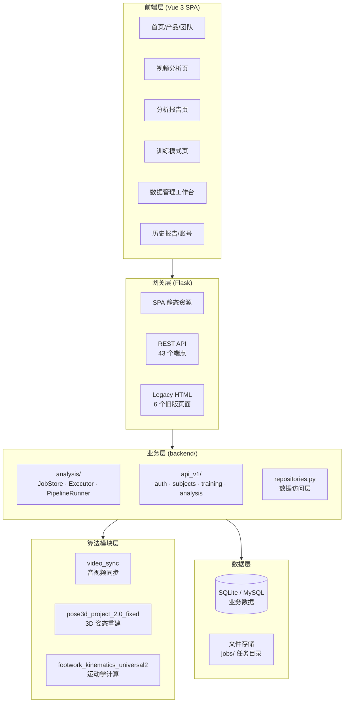

### 2.2 技术栈

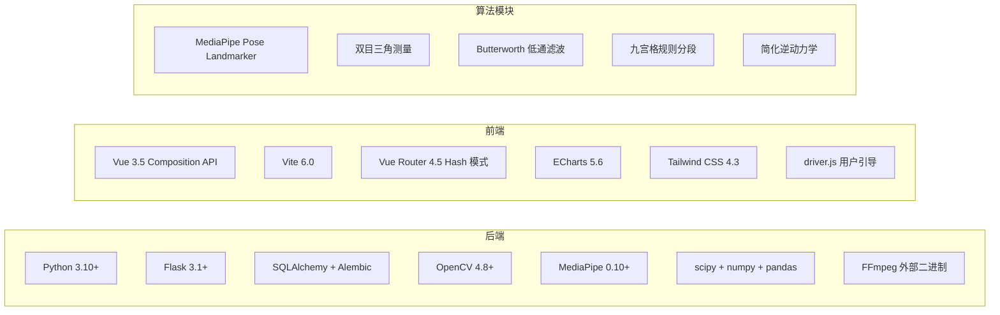

---

## 3. 技术路线：五阶段分析流水线

### 端到端流程图

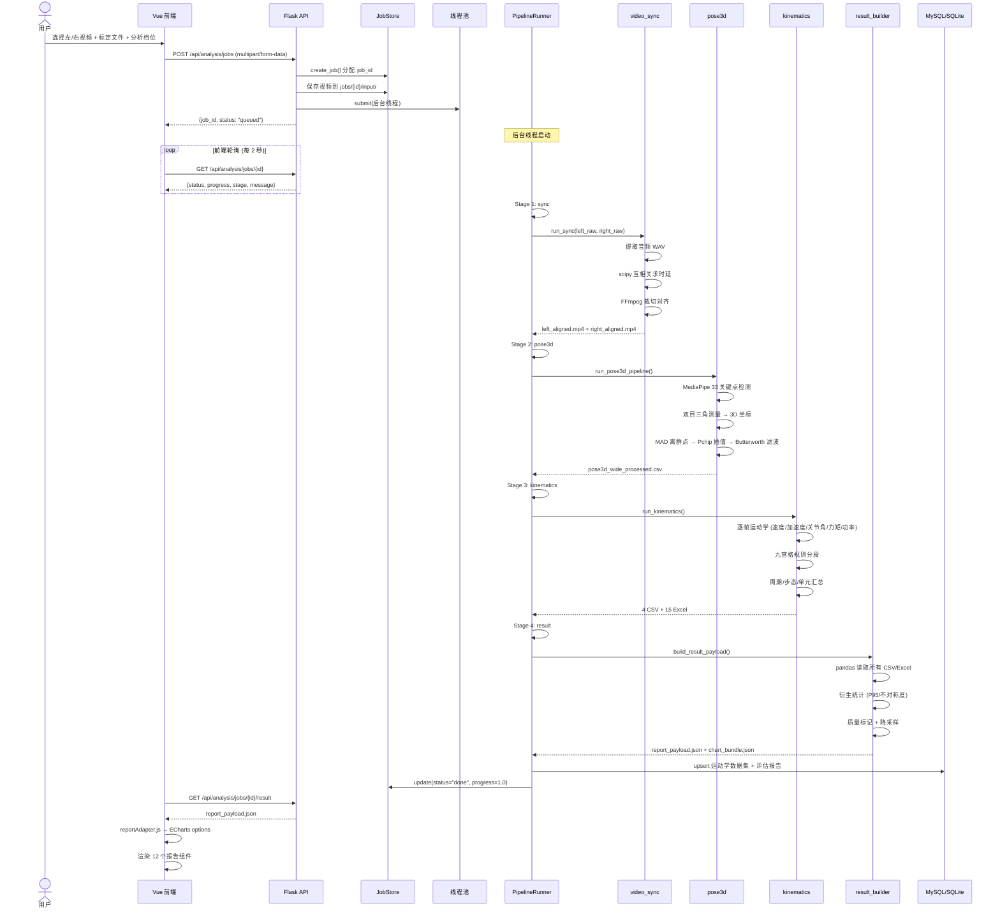

### 3.1 阶段一：视频上传与任务创建


**输入**：
- 左机位视频文件（`.mp4` / `.avi` / `.mov` 等）
- 右机位视频文件
- 可选：Matlab 立体标定 JSON 文件
- 分析档位选择：快速 / 均衡 / 高质量

**关键技术点**：
- 使用 `multipart/form-data` 上传大文件
- `job_id` 格式：`job_YYYYMMDD_HHMMSS_` + 3 字节随机 hex（`secrets.token_hex(3)`）
- 任务目录即创即建：`jobs/<job_id>/input/`
- 视频 probe 获取 fps、分辨率、时长等元数据
- 单线程线程池（`ANALYSIS_MAX_WORKERS=1`），最大排队 8 个任务

### 3.2 阶段二：双机位音视频同步

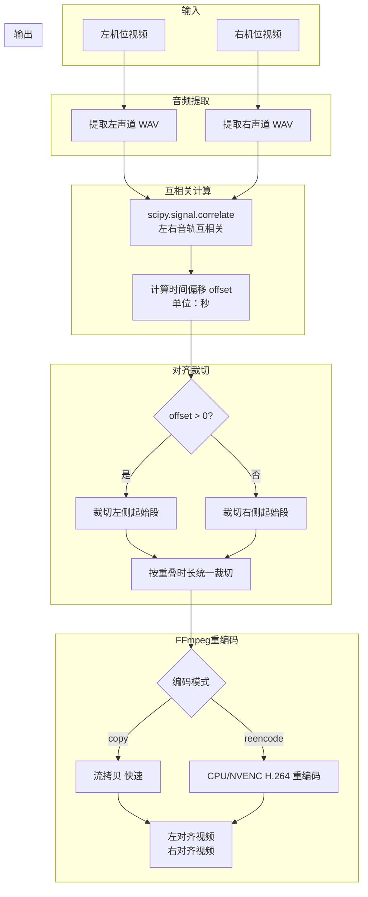

**核心算法**：
1. FFmpeg 提取双路视频的音频轨道为 WAV（16kHz 单声道）
2. `scipy.signal.correlate()` 计算左右音轨的互相关函数
3. 取互相关峰值位置对应的时延作为同步偏移量
4. 按偏移量用 FFmpeg 裁剪视频，输出等长对齐的视频对

**两种同步模式**：

| 参数 | copy 模式 | reencode 模式 |
|------|-----------|---------------|
| 编码方式 | 流拷贝（`-c copy`） | CPU/NVENC H.264 重编码 |
| 速度 | 快（秒级） | 慢（分钟级） |
| 质量 | 原始质量 | CRF 可控（20-28） |
| 容错 | 可能因编码不一致失败 | 稳定 |
| 回退策略 | 失败自动回退到 reencode | 无需回退 |

### 3.3 阶段三：3D 人体姿态重建

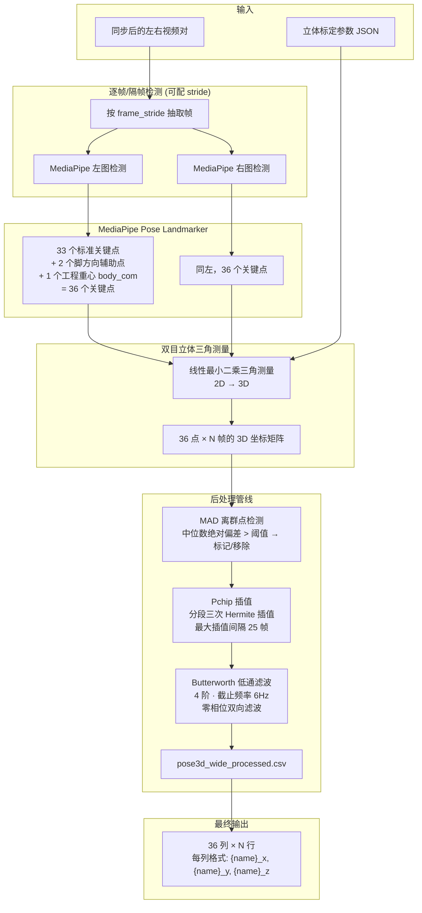

**关键参数**：

| 参数 | 说明 | 默认值 |
|------|------|--------|
| MediaPipe 模型 | `pose_landmarker_full.task` | 33 关键点 + 身体分割 |
| 检测置信度阈值 | 最小检测置信度 | 0.5 |
| 跟踪置信度阈值 | 最小跟踪置信度 | 0.5 |
| 三角测量方法 | 线性最小二乘 | - |
| MAD 阈值 | 中位数绝对偏差倍数 | 5.0 |
| 最大插值间隔 | Pchip 最大连续 NaN 帧数 | 25 |
| Butterworth 阶数 | 滤波器阶数 | 4 |
| Butterworth 截止频率 | 低通截止频率 | 6 Hz |

**关键点说明**：
- 33 个标准点：鼻/眼/耳/肩/肘/腕/髋/膝/踝/脚跟/脚尖等（MediaPipe Pose Landmarker 标准输出）
- 2 个脚方向辅助点：在脚尖前方延伸，用于计算脚部朝向
- 1 个工程重心（body_com）：基于躯干关键点加权计算，用作后续运动学分析的参考点

**后处理目的**：
- **MAD 离群点**：消除 MediaPipe 检测错误导致的 3D 跳变
- **Pchip 插值**：填补检测缺失的帧，保持运动轨迹连续性
- **Butterworth 滤波**：去除高频噪声（如视频压缩伪影引起的抖动），保留 6Hz 以下的真实人体运动信号

### 3.4 阶段四：运动学参数计算

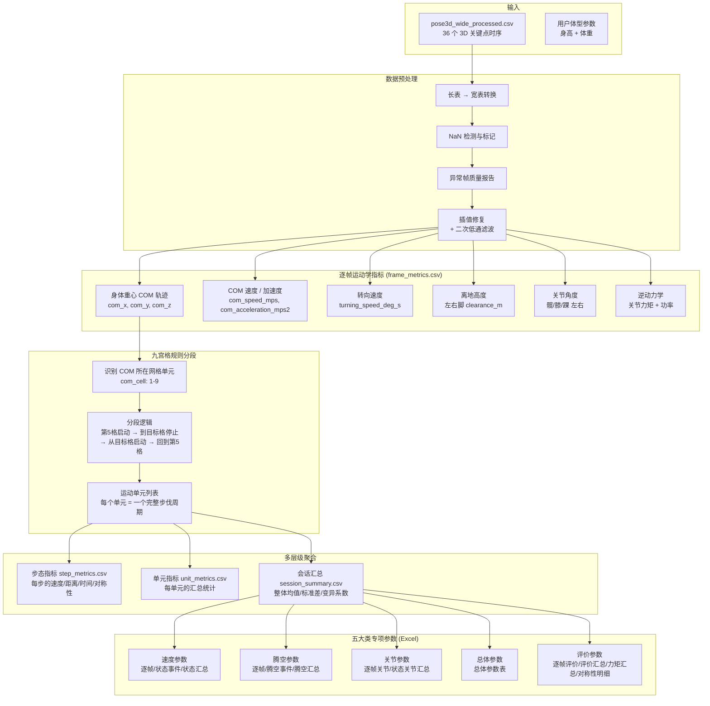

**五大类运动学参数详情**：

#### 速度参数
| 指标 | 单位 | 说明 |
|------|------|------|
| `com_speed_mps` | m/s | 身体重心瞬时合速度 |
| `com_acceleration_mps2` | m/s² | 身体重心瞬时合加速度 |
| `turning_speed_deg_s` | °/s | 身体转向角速度 |
| 状态速度汇总 | m/s | 按运动状态（静止/移动/转向）分段统计 |

#### 腾空参数
| 指标 | 单位 | 说明 |
|------|------|------|
| `left_clearance_m` | m | 左脚离地高度 |
| `right_clearance_m` | m | 右脚离地高度 |
| 腾空事件 | - | 单脚悬空 / 双脚悬空事件的起止时间与持续时长 |
| 腾空汇总 | - | 腾空次数、总时长、占比、最大腾空高度 |

#### 关节参数
| 指标 | 单位 | 说明 |
|------|------|------|
| 髋/膝/踝角度 | °（度） | 左右侧矢状面关节角度（如 `left_knee_angle_deg`） |
| 关节力矩 | N·m | 简化逆动力学估算（如 `left_hip_torque_nm`） |
| 关节功率 | W | 力矩 × 角速度（如 `left_knee_power_w`） |

**简化逆动力学公式**：
```
力矩 = I × α  （转动惯量 × 角加速度）
转动惯量 I 基于身高/体重的回归模型估算
```

#### 总体参数
整体统计：总帧数、总时长、平均速度、峰值速度、单元数、周期数等。

#### 评价参数
| 指标 | 说明 |
|------|------|
| 逐帧评价 | 每帧的综合评分 |
| 评价汇总 | 整体效率/稳定性/对称性/爆发力/循环一致性 五维评分 |
| 力矩汇总 | 各关节力矩的左右侧对比 |
| 对称性明细 | 左右侧指标的不对称度（%） |

**九宫格分段规则**：
- 训练场地划分为 3×3 九宫格（中心为第 5 格，即起始位置）
- 一个完整运动周期 = 从第 5 格启动 → 移动到目标格 → 在目标格停止 → 从目标格出发 → 返回第 5 格
- 分段状态标记：仅分析活跃部分（COM 不在第 5 格时的帧）

### 3.5 阶段五：结果聚合与报告生成

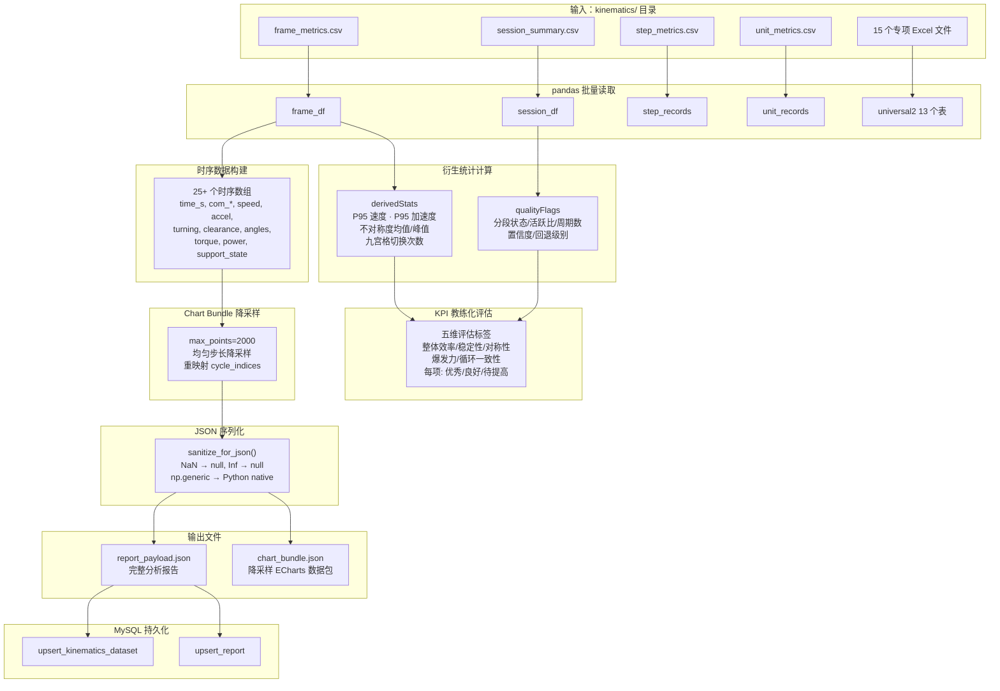

**report_payload.json 数据结构**：

```json
{
  "ok": true,
  "jobId": "job_20260615_120000_abc123",
  "status": "done",
  "summaryMetrics": { "mean_com_speed_mps": 2.34, ... },
  "derivedStats": { "com_speed_p95_mps": 3.81, "clearance_asymmetry_peak_m": 0.08, ... },
  "qualityFlags": { "segmentationStatus": "ok", "cycleCount": 12, "analysisActiveRatio": 0.85, ... },
  "kpiAssessments": { "整体效率": "优秀", "稳定性": "良好", "对称性": "待提高", ... },
  "timeseries": { "time_s": [...], "com_speed_mps": [...], ... },
  "stepMetrics": [{ ... }],
  "unitMetrics": [{ ... }],
  "dataAvailability": { "frameCount": 4800, "hasTorque": true, ... },
  "downloads": { "frame_metrics_csv": "/api/analysis/jobs/.../artifacts/frame_metrics.csv", ... },
  "universal2": { "overall": [...], "evaluation": [...], ... }
}
```

**数据可用性标记（dataAvailability）**：
前端组件通过此标记判断是否有数据可渲染，无数据时使用 mock 降级显示。包含 15 个布尔/数值字段：
`frameCount`, `cycleCount`, `stepCount`, `unitCount`, `hasSpeed`, `hasAcceleration`, `hasTurning`, `hasClearance`, `hasJointAngles`, `hasTorque`, `hasPower`, `hasHipAngles`, `hasSteps`, `hasUnits`, `hasComCell`, `hasSupportState`, `hasAirborneEvents`

### 3.6 三层分析档位

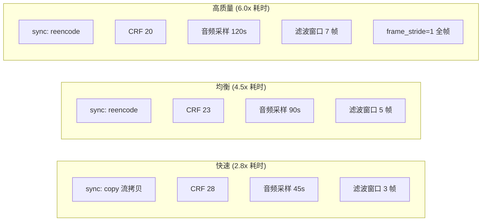

| 参数 | 快速 | 均衡 | 高质量 |
|------|------|------|--------|
| 同步视频模式 | `copy`（流拷贝） | `reencode`（重编码） | `reencode` |
| CRF 质量 | 28 | 23 | 20 |
| 音频采样上限 | 45 秒 | 90 秒 | 120 秒 |
| 滤波窗口 | 3 帧 | 5 帧 | 7 帧 |
| 帧采样策略 | 自适应降采样 | 自适应降采样 | 全帧（stride=1） |
| 估计耗时倍数 | 2.8× 视频时长 | 4.5× 视频时长 | 6.0× 视频时长 |

**帧采样策略**：
- `frame_stride` 由 `target_analysis_fps`（默认 60）与视频原始 fps 计算：`stride = round(source_fps / 60)`
- 例如 120fps 视频 → stride=2 → 实际分析 60fps
- 高质量档强制 stride=1，逐帧分析

---

## 4. 产品功能详解

### 4.1 功能全景图

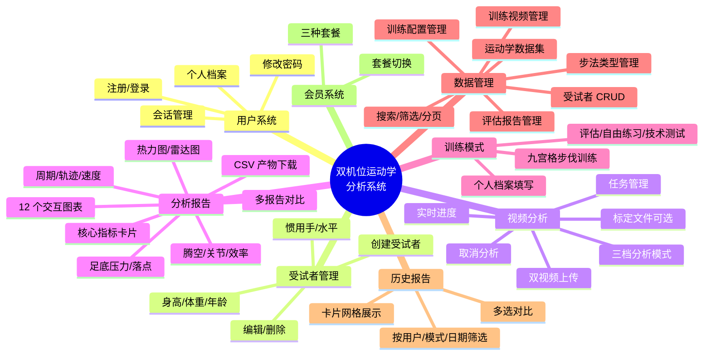

### 4.2 用户认证与受试者管理

#### 路由守卫流程

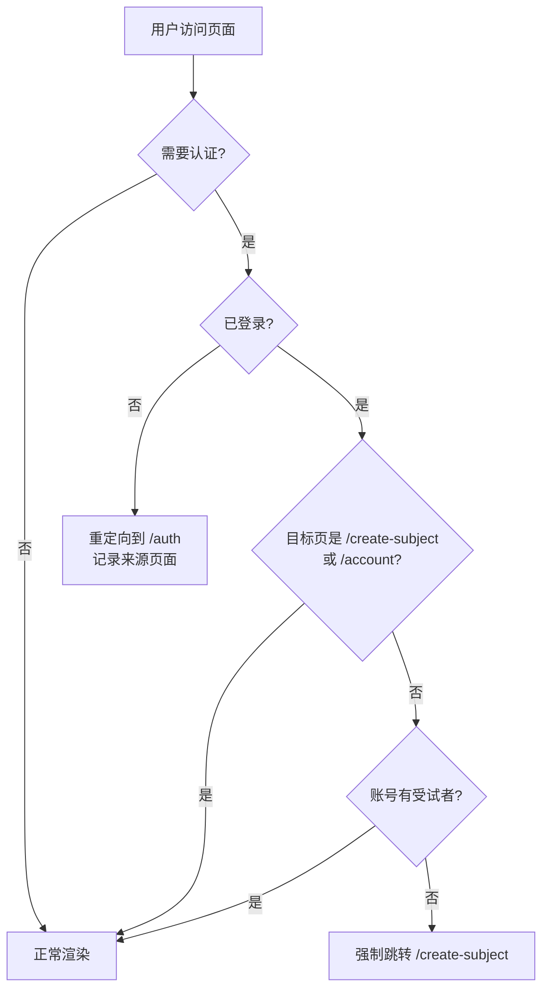

**三层守卫逻辑**（[router/index.js:63-86](frontend/src/router/index.js#L63-L86)）：
1. **分析页离开守卫**：上传中离开时弹窗确认
2. **认证守卫**：未登录跳转 `/auth`，记录来源页面以便登录后跳回
3. **受试者守卫**：已登录但无受试者时强制跳转 `/create-subject`，含 10 秒缓存防重复请求

#### 受试者数据模型

| 字段 | 类型 | 说明 |
|------|------|------|
| name | string | 姓名 |
| age | int | 年龄 |
| height_cm | int | 身高（厘米） |
| weight_kg | float | 体重（公斤） |
| hand | enum | 惯用手（左手/右手） |
| years | int | 训练年限 |
| level | enum | 水平（业余/半专业/专业） |
| is_active | bool | 软删除标记 |

### 4.3 视频分析工作流

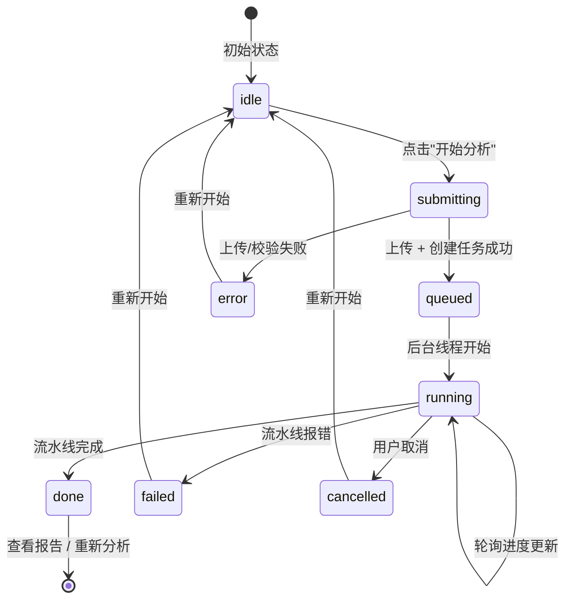

**前端 AnalysisView 的 7 种状态机**：

| 状态 | 界面表现 |
|------|---------|
| `idle` | 上传区域可用，"开始分析"按钮可点击 |
| `submitting` | 按钮显示"提交中..."，禁用 |
| `queued` | 进度条显示"排队中" |
| `running` | 进度条实时更新，显示当前阶段（sync/pose3d/kinematics） |
| `done` | 显示"查看分析报告"按钮 |
| `failed` | 显示错误信息 + "重新开始"按钮 |
| `cancelled` | 显示取消确认 |

**进度映射**：
- `sync` 阶段：5% → 25%（进度条由 SyncProgress 回调更新）
- `pose3d` 阶段：30% → 70%（由 Pose3dProgress 回调更新）
- `kinematics` 阶段：72% → 95%
- `result` 阶段：95% → 100%

### 4.4 分析报告 Dashboard

报告页（[PingpongReportView.vue](frontend/src/views/PingpongReportView.vue)）是系统的核心交付物，包含 12 个 ECharts 图表组件。

```mermaid
flowchart TB
    subgraph 数据源
        API[GET /api/analysis/jobs/{id}/result<br/>GET /api/analysis/jobs/{id}/chart-bundle]
    end

    subgraph 适配层["reportAdapter.js"]
        API --> ADAPTER[buildEChartsOptions()]
        ADAPTER --> STATS[buildStatsOverview]
        ADAPTER --> HEAT[buildHeatmap]
        ADAPTER --> RADAR[buildRadar]
        ADAPTER --> PRESS[buildFootPressure]
        ADAPTER --> TABLE[buildTablePlacement]
        ADAPTER --> PERIOD[buildPeriodTiming]
        ADAPTER --> TRAJ[buildTrajectory]
        ADAPTER --> SPEED[buildSpeedAccel]
        ADAPTER --> FLIGHT[buildFlightParams]
        ADAPTER --> JOINT[buildJointBio]
        ADAPTER --> EFF[befuildEfficiency]
        ADAPTER --> COMP[befuildComparison]
    end

    subgraph 12个组件
        STATS --> C1[StatsOverview<br/>核心指标卡片]
        HEAT --> C2[FootworkHeatmap<br/>脚步热力图]
        RADAR --> C3[RadarMetrics<br/>多维雷达图]
        PRESS --> C4[FootPressure<br/>足底压力分布]
        TABLE --> C5[TablePlacement<br/>球桌落点+AI建议]
        PERIOD --> C6[PeriodTiming<br/>步伐周期时序]
        TRAJ --> C7[DisplacementTrajectory<br/>位移轨迹]
        SPEED --> C8[SpeedAcceleration<br/>速度加速度曲线]
        FLIGHT --> C9[FlightParameters<br/>腾空参数]
        JOINT --> C10[JointBiomechanics<br/>关节生物力学]
        EFF --> C11[EfficiencyEvaluation<br/>效率评估]
        COMP --> C12[ComparisonComprehensive<br/>综合对比]
    end
```

#### 12 个报告组件详情

**1. StatsOverview（核心指标卡片）**
- 展示五维 KPI 评估：整体效率、稳定性、对称性、爆发力、循环一致性
- 每项标注"优秀 / 良好 / 待提高"标签
- 数值 + 评估阈值可视化

**2. FootworkHeatmap（脚步热力图）**
- 以九宫格为底图，展示 COM 在各格子的停留时间/频次热力
- 颜色深浅反映活跃程度

**3. RadarMetrics（雷达图）**
- 六维雷达：速度、加速度、稳定性、对称性、腾空能力、效率
- 直观对比左右侧差异

**4. FootPressure（足底压力分布）**
- 左右脚对比的压力/离地高度可视化
- 基于离地高度和支撑状态数据

**5. TablePlacement（球桌落点分布）**
- 球桌平面上的落点分布散点图
- 附 AI 建议文字

**6. PeriodTiming（步伐周期时序）**
- 柱状图展示每个周期的时长
- 标注均值线和变异系数

**7. DisplacementTrajectory（位移轨迹）**
- 二维/三维轨迹图展示 COM 在空间中的运动路径
- 按九宫格着色区分

**8. SpeedAcceleration（速度与加速度曲线）**
- 双 Y 轴时序折线图
- 上轴：速度（m/s），下轴：加速度（m/s²）

**9. FlightParameters（腾空参数）**
- 单脚/双脚悬空事件的甘特图或散点图
- 悬空时长和最大高度统计

**10. JointBiomechanics（关节运动学）**
- 髋/膝/踝角度、力矩、功率的多通道时序图
- 左右侧叠加对比

**11. EfficiencyEvaluation（运动效率评估）**
- 综合效率评分
- 速度-稳定性-对称性三元平衡图

**12. ComparisonComprehensive（综合对比）**
- 支持多份报告横向对比
- 关键指标并排展示

#### 数据流：API → ECharts

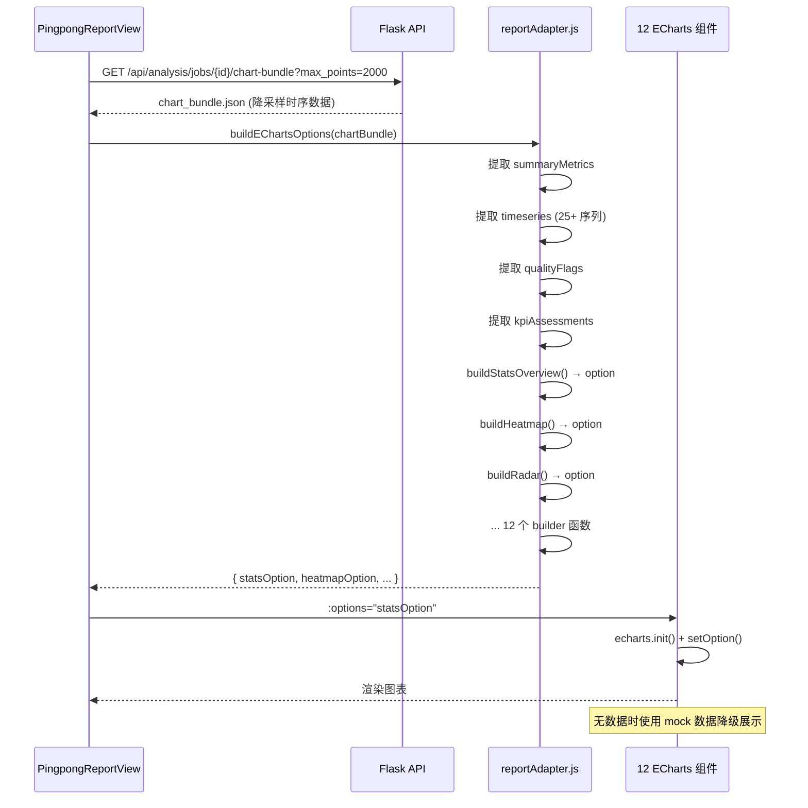

**降采样策略**：
- 原始数据可能高达数万帧
- `max_points=2000`，按 `step = ceil(n / 2000)` 均匀抽取
- `cycle_indices` 同步重映射到降采样后的索引
- 保证 ECharts 渲染流畅（< 2000 数据点）

### 4.5 训练模式

**三种训练模式**：

| 模式 | 说明 |
|------|------|
| 评估模式 | 对运动员进行全面评估，输出完整报告 |
| 自由练习 | 自由步伐训练，实时九宫格反馈 |
| 技术测试 | 特定步法类型的定向测试 |

**训练流程**：
1. 填写/确认个人档案（身高、体重、年龄、惯用手、水平等级）
2. 选择训练模式
3. 进入九宫格步伐训练界面
4. 可选：Arduino 继电器触发硬件（发球机/指示灯）

### 4.6 数据管理工作台

[DataManagementView.vue](frontend/src/views/DataManagementView.vue) 管理 6 类业务资源：

| 资源 | 操作 | 索引/搜索 |
|------|------|----------|
| 受试者 | 创建/编辑/软删除 | 按姓名/活跃状态搜索 |
| 训练配置 | CRUD | 按名称/类型筛选 |
| 步法类型 | CRUD | 按编码/分类筛选 |
| 训练视频 | 查看/关联 | 按受试者/日期筛选 |
| 运动学数据集 | 查看/删除 | 按受试者/日期筛选，分页 |
| 评估报告 | 查看/删除 | 按受试者/模式/日期筛选，分页 |

### 4.7 会员系统

[MembershipView.vue](frontend/src/views/MembershipView.vue) 提供三种套餐选择（UI 层面，后端 RBAC 模块待激活）：

| 套餐 | 功能范围 |
|------|---------|
| 基础版 | 有限次数分析 + 基础报告 |
| 专业版 | 无限分析 + 完整报告 + 数据导出 |
| 团队版 | 专业版 + 多账号管理 + 团队对比 |

---

## 5. 数据库设计

### 5.1 ER 图

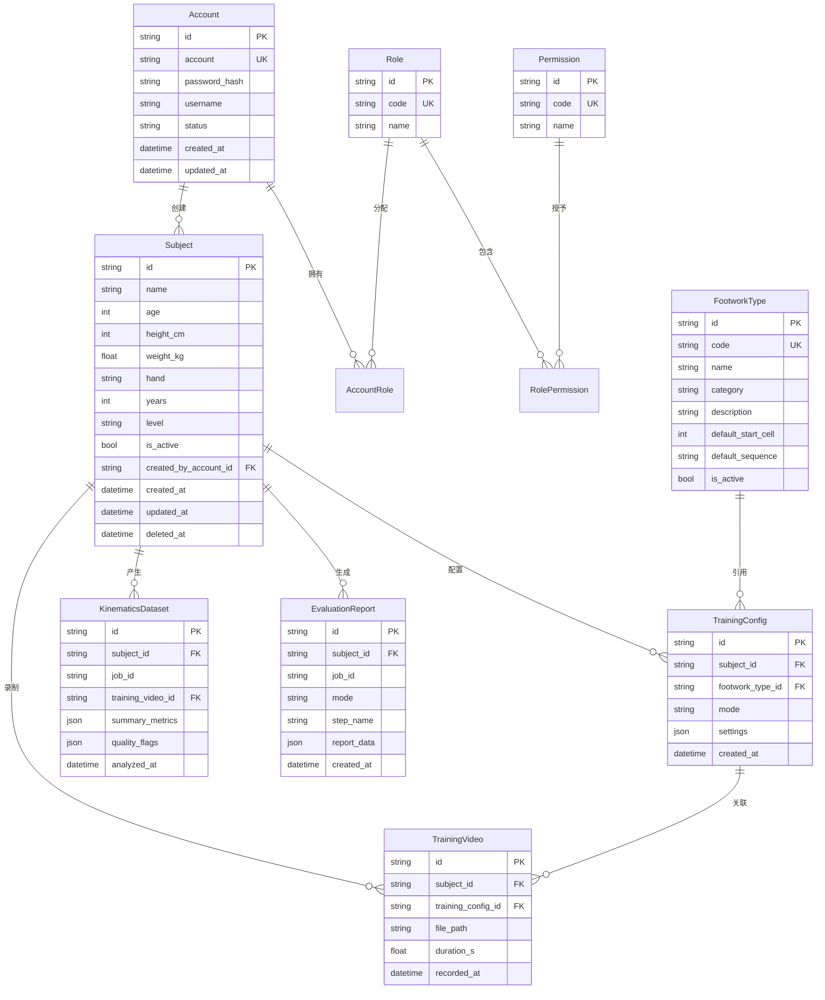

### 5.2 ORM 模型清单（[models.py](web_1/backend/models.py)）

共 10 个核心表 + 3 个关联表：

| 模型 | 表名 | 用途 |
|------|------|------|
| Account | accounts | 用户账号 |
| Subject | subjects | 受试者档案（软删除） |
| Role | roles | RBAC 角色 |
| Permission | permissions | RBAC 权限 |
| AccountRole | account_roles | 账号-角色关联 |
| RolePermission | role_permissions | 角色-权限关联 |
| FootworkType | footwork_types | 步法类型（软删除） |
| RouteDefinition | route_definitions | 步法路线定义 |
| TrainingConfig | training_configs | 训练配置 |
| TrainingVideo | training_videos | 训练视频记录 |
| AnalysisJob | analysis_jobs | 分析任务（从 JobStore 同步） |
| KinematicsDataset | kinematics_datasets | 运动学数据集 |
| EvaluationReport | evaluation_reports | 评估报告 |

---

## 6. API 架构

### 6.1 路由结构总览

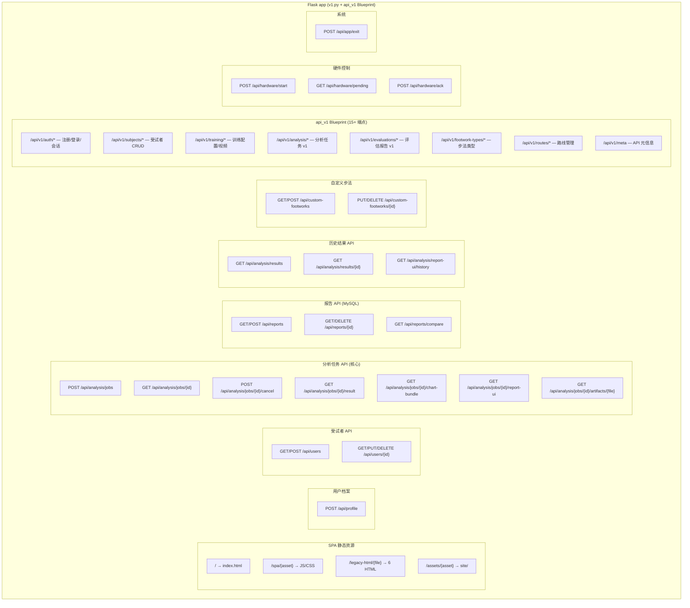

### 6.2 API 约定

**请求**：JSON 请求体使用 `request.get_json(silent=True)`，`None` 或非 `dict` 时返回 `400`

**响应格式**：
```json
// 成功
{ "ok": true, "data": { ... } }

// 失败
{ "ok": false, "error": "具体错误描述" }
```

**分页**：`?offset=0&limit=20`，返回 `{ total, items }`

### 6.3 核心 API 详解

#### 创建分析任务
```
POST /api/analysis/jobs
Content-Type: multipart/form-data

left_video: File
right_video: File
stereo_file: File (可选)
analysis_profile: "快速" | "均衡" | "高质量"
user_id: string
report_mode: "eval" | "free" | "test"
sync_video_mode: "copy" | "reencode" (可选)
sync_crf: string (可选)
sync_max_audio_seconds: number (可选)

Response: { ok: true, job_id: "job_20260615_..." }
```

#### 轮询任务状态
```
GET /api/analysis/jobs/{job_id}

Response: {
  ok: true,
  job_id: "...",
  status: "queued" | "running" | "done" | "failed",
  stage: "sync" | "pose3d" | "kinematics" | null,
  progress: 0.0 ~ 1.0,
  message: "双机位同步中…",
  error: null | "错误信息",
  error_code: null | "SYNC_FAILED" | "POSE3D_FAILED" | "KINEMATICS_FAILED"
}
```

#### 获取分析结果
```
GET /api/analysis/jobs/{job_id}/result
→ report_payload.json (完整数据，可达数十 MB)

GET /api/analysis/jobs/{job_id}/chart-bundle?max_points=2000
→ chart_bundle.json (降采样版本，< 5 MB)
```

#### 下载产物 CSV
```
GET /api/analysis/jobs/{job_id}/artifacts/frame_metrics.csv
GET /api/analysis/jobs/{job_id}/artifacts/session_summary.csv
GET /api/analysis/jobs/{job_id}/artifacts/step_metrics.csv
GET /api/analysis/jobs/{job_id}/artifacts/unit_metrics.csv
```

**安全性**：白名单校验，只允许下载上述 4 个预定义文件名。

---

## 7. 前端技术架构

### 7.1 项目结构

```
frontend/
├── index.html                     # Vite 入口
├── package.json                   # 依赖 (Vue 3.5, ECharts 5.6, Tailwind 4.3)
├── vite.config.js                 # 构建配置 (output → ../web_1/static/spa/)
└── src/
    ├── main.js                    # Vue 应用入口
    ├── App.vue                    # 根组件
    ├── router/
    │   ├── index.js               # 14 条路由 + 3 层守卫
    │   └── guard.js               # 认证守卫辅助函数
    ├── views/                     # 10 个页面组件
    │   ├── AnalysisView.vue       # 视频分析页
    │   ├── PingpongReportView.vue # 分析报告页
    │   ├── TrainingView.vue       # 训练模式页
    │   ├── DataManagementView.vue # 数据管理工作台
    │   ├── ReportHistoryView.vue  # 历史报告页
    │   ├── AuthView.vue           # 登录/注册
    │   ├── AccountView.vue        # 账号管理
    │   ├── CreateSubjectView.vue  # 创建受试者
    │   ├── MembershipView.vue     # 会员购买
    │   └── LegacyHtmlView.vue     # iframe 嵌入旧版 HTML
    ├── components/
    │   ├── report/                # 12 个 ECharts 报告组件
    │   │   ├── StatsOverview.vue
    │   │   ├── FootworkHeatmap.vue
    │   │   ├── RadarMetrics.vue
    │   │   ├── FootPressure.vue
    │   │   ├── TablePlacement.vue
    │   │   ├── PeriodTiming.vue
    │   │   ├── DisplacementTrajectory.vue
    │   │   ├── SpeedAcceleration.vue
    │   │   ├── FlightParameters.vue
    │   │   ├── JointBiomechanics.vue
    │   │   ├── EfficiencyEvaluation.vue
    │   │   └── ComparisonComprehensive.vue
    │   ├── SiteNav.vue            # 站点导航
    │   ├── TrainingGrid.vue       # 九宫格训练网格
    │   └── ...                    # 其他通用组件
    ├── services/
    │   ├── api.js                 # API 调用封装
    │   └── reportAdapter.js       # 数据 → ECharts options 适配器
    ├── stores/
    │   └── storage.js             # localStorage 封装 (ai_sport_lab.*)
    ├── guides/
    │   ├── guideScheduler.js      # driver.js 引导调度
    │   └── ...                    # 各页面引导步骤
    └── utils/
        └── chartTheme.js          # ECharts 主题工具
```

### 7.2 路由设计

| 路径 | 组件 | 认证 | 特殊 meta |
|------|------|------|-----------|
| `/` | redirect → `/home` | 否 | - |
| `/home` | LegacyHtmlView | 否 | fullFrame, legacyFile=home.html |
| `/product` | LegacyHtmlView | 否 | fullFrame, legacyFile=product.html |
| `/team` | LegacyHtmlView | 否 | fullFrame, legacyFile=team.html |
| `/auth` | AuthView | 否 | - |
| `/membership` | MembershipView | 否 | - |
| `/training` | TrainingView | **是** | - |
| `/analysis` | AnalysisView | **是** | 离开守卫 |
| `/data-management` | DataManagementView | **是** | - |
| `/report-history` | ReportHistoryView | **是** | - |
| `/report/:jobId?` | PingpongReportView | **是** | 可选路由参数 |
| `/account` | AccountView | **是** | 豁免受试者检查 |
| `/create-subject` | CreateSubjectView | **是** | 豁免受试者检查 |
| `/loading` | LegacyHtmlView | **是** | fullFrame, legacyFile=loading.html |
| `/settings` | LegacyHtmlView | **是** | fullFrame, legacyFile=settings.html |

### 7.3 混合架构说明

系统采用 **SPA + Legacy iframe** 混合架构：
- **SPA 页面**（8 个）：Vue 3 组件，完整交互体验
- **Legacy 页面**（6 个）：`site/` 目录下的纯 HTML+CSS，通过 `LegacyHtmlView.vue` 以全屏 iframe 嵌入

6 个 Legacy 页面：`home.html`, `product.html`, `team.html`, `loading.html`, `settings.html`（原还有 `report.html`）。

---

## 8. 部署与运维

### 8.1 环境变量

| 变量 | 默认值 | 说明 |
|------|--------|------|
| `DATABASE_URL` | SQLite 自动路径 | 生产环境必设 MySQL |
| `ANALYSIS_MAX_WORKERS` | `1` | 分析线程池大小（建议保持 1，算法模块非线程安全） |
| `ANALYSIS_MAX_QUEUE` | `8` | 最大排队任务数 |
| `ANALYSIS_KEEP_INPUT_VIDEOS` | `1` | 保留原始上传视频 |
| `ANALYSIS_KEEP_SYNC_VIDEOS` | `0` | 保留同步后视频（节省磁盘） |
| `ANALYSIS_KEEP_INTERMEDIATES` | `0` | 保留 pose3d 中间产物（节省磁盘） |
| `KINEMATICS_EXPORT_PLOT_JSON` | `0` | 保留绘图 JSON |
| `FLASK_USE_RELOADER` | `0` | 生产环境必须关闭 |

### 8.2 任务目录结构

```
jobs/<job_id>/
├── meta.json                         # 任务状态 + 进度 + 元数据
├── input/
│   ├── left_raw.mp4                  # 原始左视频
│   └── right_raw.mp4                 # 原始右视频
├── synced/
│   ├── left_aligned.mp4              # 同步后左视频
│   └── right_aligned.mp4             # 同步后右视频
├── pose3d_session/                   # pose3d 输入（复制自 synced + 标定参数）
├── pose3d_out/                       # pose3d 原始输出
│   └── pair_001/                     # (pose2d_all.csv, pose3d_abs.csv ...)
├── pose3d/                           # 精选最终 CSV
│   ├── pose3d_abs.csv
│   ├── pose3d_wide.csv
│   └── pose3d_wide_processed.csv     # ★ 运动学模块的输入
├── kinematics/                        # 运动学全部输出
│   ├── frame_metrics.csv
│   ├── session_summary.csv
│   ├── step_metrics.csv
│   ├── unit_metrics.csv
│   ├── 速度参数/  (3 Excel)
│   ├── 腾空参数/  (3 Excel)
│   ├── 关节参数/  (2 Excel)
│   ├── 总体参数/  (1 Excel)
│   ├── 评价参数/  (4 Excel)
│   └── 位移参数/  (1 Excel)
├── logs/
│   └── pipeline.log                   # 完整执行日志
└── report/
    ├── report_payload.json            # 聚合后的前端报告数据
    ├── chart_bundle.json              # 降采样 ECharts 数据包
    ├── data_quality_report.json       # 数据质量诊断报告
    └── perf_snapshot.json             # 性能指标快照
```

### 8.3 产物缓存

[ArtifactCache](web_1/backend/analysis/artifact_cache.py) 提供阶段级产物缓存：

- **sync 缓存**：以原始视频文件 + 同步参数为 key，命中后跳过同步阶段
- **pose3d 缓存**：以同步后视频 + 标定参数 + 检测参数为 key，命中后跳过 3D 重建

缓存目录：`web_1/artifacts/immutable/`，按文件内容哈希存储，内容不变则永久有效。

### 8.4 性能监控

每个任务完成后生成 `perf_snapshot.json`，记录：

```json
{
  "profile": "快速",
  "kpi": {
    "T_sync": 12.3,        // 同步耗时 (秒)
    "T_pose2d": 45.6,      // 姿态检测耗时
    "T_triangulate": 2.1,  // 三角测量耗时
    "T_filter": 1.8,       // 滤波耗时
    "T_pose3d": 49.5,      // pose3d 总耗时
    "T_kinematics": 15.2,  // 运动学耗时
    "T_total": 80.4,       // 总耗时
    "realtime_ratio": 4.5  // 耗时/视频时长 比
  },
  "cache_hit": { "sync": false, "pose3d": false }
}
```

### 8.5 启动命令

```powershell
# 生产模式
cd frontend; npm run build          # 构建 SPA → web_1/static/spa/
cd ..\web_1; python v1.py          # 启动 Flask (http://127.0.0.1:5000)

# 开发模式
cd web_1; python v1.py             # 终端 1: Flask API
cd frontend; npm run dev           # 终端 2: Vite dev server (http://127.0.0.1:5173)

# 安装依赖
pip install -r web_1/requirements.txt   # 最小依赖
cd frontend; npm install                # 前端依赖
ffmpeg -version                         # 确认 FFmpeg 可用
```

---

## 附录：项目文件清单

### 后端核心文件

| 文件 | 行数 | 职责 |
|------|------|------|
| `web_1/v1.py` | ~1000+ | Flask 入口，43 个路由端点 |
| `web_1/backend/analysis/pipeline_runner.py` | 731 | 主编排器，5 阶段流水线 |
| `web_1/backend/analysis/jobs.py` | 243 | 任务状态管理 + 目录结构 |
| `web_1/backend/analysis/result_builder.py` | 611 | 结果聚合 + JSON 构建 |
| `web_1/backend/analysis/analysis_profiles.py` | 114 | 三档分析参数 |
| `web_1/backend/analysis/sync_service.py` | 71 | 同步模块适配器 |
| `web_1/backend/analysis/pose3d_service.py` | - | pose3d 模块适配器 |
| `web_1/backend/analysis/kinematics_service.py` | - | 运动学模块适配器 |
| `web_1/backend/models.py` | - | 13 个 ORM 模型 |
| `web_1/backend/repositories.py` | - | 数据访问层 |

### 算法模块

| 目录 | 核心文件 | 职责 |
|------|---------|------|
| `video_sync/lib/sync.py` | 26KB | 双机位音视频同步 |
| `pose3d_project_2.0_fixed/pose3d_pkg/cli/run_pipeline.py` | 22KB | 3D 姿态重建主入口 |
| `footwork_kinematics_universal2/src/pipeline/custom_analysis.py` | 74KB | 运动学核心分析引擎 |

### 前端核心文件

| 文件 | 职责 |
|------|------|
| `frontend/src/router/index.js` | 14 条路由 + 3 层守卫 |
| `frontend/src/services/reportAdapter.js` | API 数据 → ECharts options |
| `frontend/src/views/AnalysisView.vue` | 视频上传 + 进度状态机 |
| `frontend/src/views/PingpongReportView.vue` | 报告页容器 |
| `frontend/src/components/report/*.vue` | 12 个 ECharts 图表组件 |

---

> 文档生成时间：2026-06-15 · 基于项目实际代码分析
