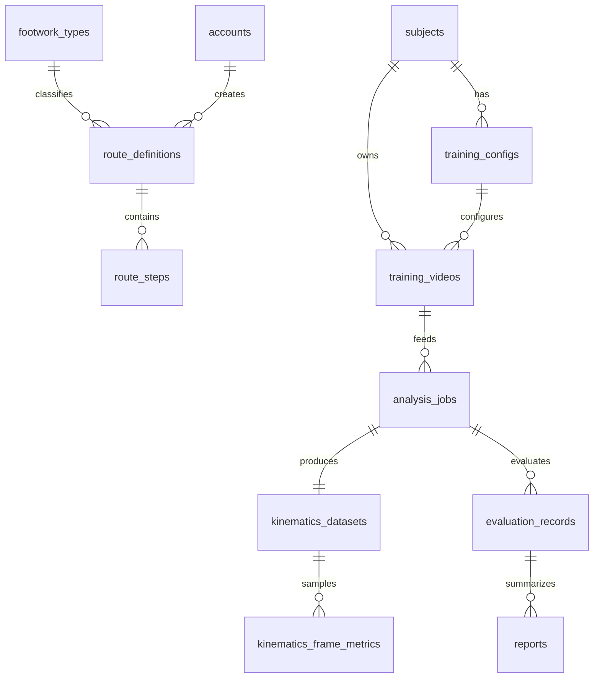

# 数据库架构与开发约定

> 适用版本：pose3d_project_3.0（单 Flask + MySQL）  
> 模型源码：`web_1/backend/models.py`  
> 迁移脚本：`web_1/migrations/versions/0001_initial_mysql_schema.py`  
> 兼容层：`web_1/backend/repositories.py`

## 1. 架构定位

| 存储 | 放什么 | 不放什么 |
|------|--------|----------|
| **MySQL** | 业务主数据、状态、外键、可查询摘要、文件路径 | 视频二进制、完整 CSV 逐帧全量 |
| **文件系统** | `web_1/jobs/` 任务目录、分析 CSV/JSON、图表 bundle | — |
| **运行时辅助** | `JobStore` + `meta.json`（调试/恢复） | 不作为长期业务索引（业务索引以 `analysis_jobs` 为准） |

旧 **SQLite**（`web_1/data/app.db`）已退出业务链路，**不迁移历史数据**。

## 2. 技术栈

- **ORM**：Flask-SQLAlchemy（`web_1/backend/db.py`）
- **迁移**：Alembic（`web_1/alembic.ini`，`script_location = migrations`）
- **驱动**：PyMySQL（连接串 `mysql+pymysql://...`）

### 2.1 连接配置（环境变量，优先级从高到低）

1. `POSE3D_DATABASE_URL`
2. `DATABASE_URL`
3. `SQLALCHEMY_DATABASE_URI`
4. 默认：`mysql+pymysql://root@127.0.0.1:3306/pose3d_project_3?charset=utf8mb4`

应用启动时 `v1.py` 调用 `init_database(app)` 绑定连接池（`pool_pre_ping`、`pool_recycle`）。

### 2.2 本地建库与迁移

```powershell
# 1. 创建空库（MySQL 5.5 用 utf8；MySQL 8 可用 utf8mb4）
& "C:\Program Files\MySQL\MySQL Server 5.5\bin\mysql.exe" -u root -p -e "CREATE DATABASE IF NOT EXISTS pose3d_project_3 CHARACTER SET utf8 COLLATE utf8_general_ci;"

# 2. 安装依赖
python -m pip install -r .\web_1\requirements.txt

# 3. 执行迁移（在 web_1 目录，先激活 .venv）
cd web_1
$env:POSE3D_DATABASE_URL = "mysql+pymysql://root:密码@127.0.0.1:3306/pose3d_project_3?charset=utf8"
python -m alembic upgrade head
```

**迁移失败常见处理**

| 报错 | 原因 | 处理 |
|------|------|------|
| `1049 Unknown database` | 未建库 | 执行上面 CREATE DATABASE |
| `1050 Table already exists` | 上次迁移半路失败，表在但 `alembic_version` 未记录 | 运行 `powershell -File web_1\scripts\reset_pose3d_mysql_db.ps1` 后重新 `alembic upgrade head` |
| `syntax error near 'JSON'` | MySQL 5.5 无 JSON 类型 | 项目迁移已改为 TEXT；需拉最新代码后重置库再迁移 |

```powershell
# 一键清空开发库（仅开发环境）
powershell -File web_1\scripts\reset_pose3d_mysql_db.ps1
cd web_1
python -m alembic upgrade head

# 4. 契约测试（可选，不连库也能跑部分检查）
cd ..
python -m unittest web_1.tests.test_mysql_migration_contract -v
```

**Schema 变更流程**（全组遵守）：

1. 先改 `models.py`
2. 再 `alembic revision --autogenerate` 或手写 migration
3. 主脑审核后合并；禁止每人私自在生产库手改表结构

## 3. 表清单与负责人

| 表名 | 业务含义 | 主负责人 |
|------|----------|----------|
| `subjects` | 受试者/运动员 | 陈彦竹 |
| `footwork_types` | 基础步伐字典 | 陈彦竹 |
| `route_definitions` | 训练路线方案 | 雷润华 |
| `route_steps` | 路线步骤 | 雷润华 |
| `training_configs` | 训练参数配置 | 金彦廷 |
| `training_videos` | 左右视频元数据（路径） | 金彦廷 |
| `accounts` / `roles` / `permissions` / `account_roles` / `role_permissions` | 最小 RBAC | 金彦廷 |
| `analysis_jobs` | 分析任务状态 | 许婉其 |
| `kinematics_datasets` | 运动学产物索引 | 许婉其 |
| `kinematics_frame_metrics` | 关键逐帧指标（抽样） | 许婉其 |
| `evaluation_records` | 训练效果评估 | 郝雨萱 |
| `reports` | 历史报告摘要 | 郝雨萱 |
| `analysis_results` | 分析结果快照（兼容旧 result store） | 许婉其（接入，不重复建表） |

## 4. 实体关系（逻辑）



**依赖顺序（开发）**：`subjects` / `footwork_types` → `route_definitions` → `training_configs` / `training_videos` → `analysis_jobs` → `kinematics_*` → `evaluation_records` / `reports`

## 5. 删除与外键策略

| 策略 | 适用 |
|------|------|
| **软删除** | `subjects`、`footwork_types`、`route_definitions`（`is_active` + `deleted_at`） |
| **RESTRICT** | 已被训练/视频/任务引用的主数据，禁止物理删除 |
| **CASCADE** | `route_steps` 随路线删除；`kinematics_*` 随 job 删除 |
| **SET NULL** | 可选关联（如 `created_by_account_id`） |

已被历史任务引用的受试者、步伐、路线：**不得物理删除**，避免报告与对比断链。

## 6. API 与数据层约定

### 6.1 响应结构（全组统一）

- 成功：`{"ok": true, ...}`
- 失败：`{"ok": false, "error": "<机器可读码>"}`
- 列表：在兼容前提下增加 `items`、`total`、`limit`、`offset`（新接口 `/api/v1/*` 必须带分页字段）

### 6.2 旧 URL 兼容（禁止随意改路径）

| 旧接口 | 映射表/逻辑 |
|--------|-------------|
| `/api/users` | `subjects` |
| `/api/custom-footworks` | `route_definitions` |
| `/api/analysis/jobs` | `analysis_jobs` + 文件系统 pipeline |
| `/api/reports` | `reports` |

新接口建议前缀：`/api/v1/...`，实现放在 `web_1/backend/` 下按模块分文件，路由仍注册在 `v1.py`（薄路由）。

### 6.3 查询参数（列表类接口）

| 参数 | 含义 |
|------|------|
| `keyword` | 名称模糊搜索 |
| `limit` / `offset` | 分页 |
| `is_active` | 软删过滤 |
| `subject_id` | 按受试者过滤 |
| `status` / `stage` | 任务状态过滤 |
| `start_date` / `end_date` | 时间范围 |

### 6.4 JSON 列使用原则

- `*_json` / `summary_json`：快照、 rhythm、probe、摘要
- **需要搜索、排序、统计的字段**：必须用普通列 + 索引，不要只塞进 JSON

## 7. 已实现 vs 待接入

| 能力 | 状态 | 位置 |
|------|------|------|
| Schema + Alembic 首版 | 已落地 | `models.py`, `0001_initial_mysql_schema.py` |
| `footwork_types` 种子 | 已落地 | `0002_seed_footwork_types.py` |
| `subjects` 兼容 `/api/users` | 已落地 | 兼容全量 + 可选分页；`/api/v1/subjects` |
| `/api/v1` 骨架 | 已落地 | `backend/api_v1/` |
| 分析任务写 MySQL | 已挂钩 | `v1.py` → `repo.upsert_analysis_job_from_record` |
| `footwork_types` CRUD + v1 API | 已落地 | 陈彦竹 |
| `route_definitions` 完整步骤表 | 已落地 | 雷润华 |
| RBAC 后端校验 | 待开发 | 金彦廷 |
| `kinematics_datasets` pipeline 回填 | 已挂钩 | 许婉其 |
| `evaluation_records` 自动生成 | 已挂钩 | 郝雨萱 |

## 8. 文件路径约定（与表字段对应）

分析完成后，典型产物（仍在 `jobs/<job_id>/` 等目录）：

| 文件 | 表字段（`kinematics_datasets`） |
|------|----------------------------------|
| `frame_metrics.csv` | `frame_csv_path` |
| `session_summary.csv` | `session_csv_path` |
| `step_metrics.csv` | `step_csv_path` |
| `unit_metrics.csv` | `unit_csv_path` |
| 报告 JSON / chart bundle | `report_payload_path`, `chart_bundle_path` |

## 9. 模块边界（主脑已落地）

| 负责人 | 新 API 包路径 | 说明 |
|--------|---------------|------|
| 陈彦竹 | `backend/api_v1/subjects.py`, `footwork_types.py` | 已实现 subjects 与 footwork_types CRUD |
| 雷润华 | `backend/api_v1/routes.py` | 已实现 routes + route_steps 最小 CRUD |
| 金彦廷 | `backend/api_v1/training.py`, `rbac.py` | 已实现 training_configs CRUD、training_videos 元数据管理、accounts/roles/permissions 最小 RBAC |
| 许婉其 | `backend/api_v1/analysis.py` | 已实现 kinematics_datasets 与 metrics 只读查询 |
| 郝雨萱 | `backend/api_v1/evaluations.py` | 已实现 evaluation_records CRUD |

共享工具：`backend/api_utils.py`（分页）、`backend/delete_policy.py`（软删）。  
机器可读：`GET /api/v1/meta/modules`。详见 `web_1/backend/README_MODULES.md`。

### 9.1 本地基线检查

```powershell
cd d:\app\Mybackups\pose3d_project_3.0
python web_1\scripts\check_mysql_baseline.py
# 有 MySQL 时：
python web_1\scripts\check_mysql_baseline.py --migrate --schema
```

## 10. 相关源码索引

| 文件 | 职责 |
|------|------|
| `web_1/backend/db.py` | 连接串、命名约定、`init_database` |
| `web_1/backend/models.py` | 全部 ORM 模型 |
| `web_1/backend/repositories.py` | 旧 API 形状、MySQL 读写 |
| `web_1/v1.py` | 路由注册、分析任务 MySQL 同步 |
| `web_1/backend/analysis/jobs.py` | 运行时 JobStore |
| `web_1/tests/test_mysql_migration_contract.py` | 迁移契约测试 |

## 11. 全链路验收（集成）

按顺序跑通一条真实数据：

**受试者 → 基础步伐/路线 → 训练配置 → 上传视频 → 分析任务 → 运动学索引 → 评估 → 历史报告**

命令基线：

```powershell
cd frontend
npm.cmd test
npm.cmd run build
```
## Schema 修复补充（2026-06-04）

- `route_definitions` 不再使用 `name_norm + sequence_canon` 复合唯一约束；MySQL 5.5 InnoDB 767-byte key limit 下该组合可能超长。
- 路线活跃唯一性统一使用 `active_name_sequence_hash VARCHAR(64) NULL UNIQUE`。创建/更新活跃路线时写入 `SHA-256(name_norm + separator + sequence_canon)`；软删除时必须把该列置为 `NULL`，这样允许重新创建同名同路线。
- 不要改成 `UNIQUE(hash, is_active)` 或 `UNIQUE(hash, is_active, deleted_at)`；前者会限制已软删除重复数据，后者在 MySQL 的 `NULL` 唯一规则下不能可靠约束活跃重复。
- ORM 中所有 `*_json` / `summary_json` 字段使用 `JsonText`，底层为 `TEXT`；迁移文件继续通过 `json_column()` 生成 `TEXT`，兼容 MySQL 5.5。
