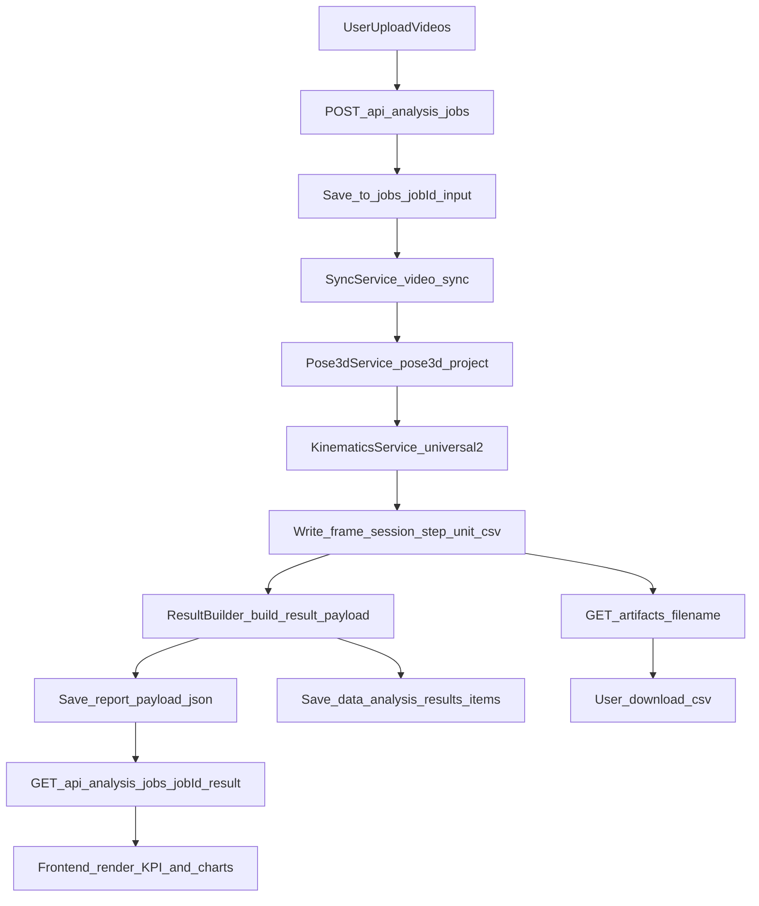

# Pose3D 项目总 README（全链路版）

## 1. 项目定位

本项目是一个双机位视频分析系统，目标是把左右机位视频转成可视化运动学结果。  
当前主应用为 `web_1`，运行后同时提供前端页面与后端 API。

分析主链路：

`上传视频 -> 视频同步 -> 3D重建 -> 运动学计算 -> 结果聚合 -> 前端图表与CSV下载`

---

## 2. 全项目结构与关键文件

```text
pose3d_project_2.0/                     # 仓库根目录名以本机克隆路径为准
├─ web_1/                               # 当前主应用（前后端一体）
│  ├─ v1.py                             # Flask 入口与 API 路由
│  ├─ static/spa/                       # Vue 构建产物（训练 + 导航）
│  ├─ （legacy 页在 ../site/，iframe 加载）
│  ├─ static/js/analysis-dashboard.js   # 视频分析前端主逻辑
│  ├─ backend/analysis/                 # 分析后端核心
│  │  ├─ jobs.py                        # 任务状态与目录结构
│  │  ├─ executor.py                    # 并发/队列调度
│  │  ├─ pipeline_runner.py             # sync -> pose3d -> kinematics 主编排
│  │  ├─ sync_service.py                # 对接 video_sync
│  │  ├─ pose3d_service.py              # 对接 pose3d_project_2.0_fixed
│  │  ├─ kinematics_service.py          # 对接 footwork_kinematics_universal2
│  │  ├─ universal2_compat.py           # 生成 legacy CSV 包
│  │  ├─ result_builder.py              # CSV/XLSX -> 前端结果 JSON
│  │  └─ results_store.py               # 历史结果索引持久化
│  ├─ scripts/hardware/start_signal.py  # 串口硬件触发（原 warning_light 已移除）
│  ├─ jobs/                             # 每次分析任务目录
│  └─ data/analysis_results/            # 历史结果索引
├─ video_sync/                          # 双机位同步模块
├─ pose3d_project_2.0_fixed/            # 3D 姿态重建模块
├─ footwork_kinematics_universal2/      # 运动学计算模块（主版本）
├─ requirements.txt                     # 根依赖集合（全仓库合并口径，见文件头注释）
└─ web_1/requirements.txt               # 主站最小依赖（推荐日常安装）
```

---

## 3. 工程规范与优化原则（团队约定）

与教学材料中的「命名 / 注释 / 结构 / 校验 / 效率」一致，在本仓库落地时建议：

- **命名**：模块、函数、变量见名知意；前端跨文件共享的配置优先通过稳定字段挂到 `window`（如 `__WEB1_MAX_COMPARE_REPORTS__`），避免多处 magic string。
- **注释**：解释「为什么」与边界条件；避免复述代码字面含义。
- **结构**：路由与业务分层保持清晰（`v1.py` 薄路由、`backend/analysis` 编排）；复杂分支优先提前返回，减少深层嵌套。
- **文档**：Python 公共模块与入口文件使用简短 **module docstring** 说明职责；大段 API 以 README 与接口约定为准。
- **校验**：JSON 接口使用 `get_json(silent=True)` 等与现有代码一致的模式，失败返回统一 `ok: false` + `error`。
- **效率**：无测量数据前不盲目改算法阶数；本仓库已具备 **防抖上报**（`scheduleSave`）、**阶段产物缓存**（`ArtifactCache`）、**允许下载文件名白名单**（`ANALYSIS_ARTIFACTS`）等减 I/O 与重复计算手段，扩展时沿用同类模式。

更细的前端脚本顺序、设置与 `localStorage` 见 [`README_前端.md`](README_前端.md)；API 响应约定见 [`README_后端.md`](README_后端.md)。

---

## 4. 本地存储与前端事件（索引）

| 键 / 事件 | 用途 |
|-----------|------|
| `web1_max_compare_reports` | 历史报告「对比」最多可选份数（`localStorage`，默认 10，范围 2–30） |
| `web1:maxCompareReportsChanged` | 设置中修改上限后派发，`analysis-dashboard.js` 截断多选并刷新提示 |

用户与列表缓存等见 `user-management.js` 内 `sessionStorage` 键（当前用户等）。

---

## 5. 前后端连接如何实现

前端不单独起服务，直接由 Flask 提供页面和静态资源。

- 页面入口：`GET /`（`v1.py` -> `index.html`）
- 前端核心脚本：`static/js/analysis-dashboard.js`
- 后端分析接口（核心）：
  - `POST /api/analysis/jobs`：创建分析任务
  - `GET /api/analysis/jobs/<job_id>`：轮询任务状态
  - `GET /api/analysis/jobs/<job_id>/result`：获取聚合结果（图表/KPI数据）
  - `GET /api/analysis/jobs/<job_id>/artifacts/<filename>`：下载 CSV
  - `GET /api/analysis/results`：历史结果列表
  - `GET /api/analysis/results/<result_id>`：历史结果详情

---

## 6. 端到端数据流（从输入到前端展示）



### 6.1 输入阶段

- 前端上传 `left_video` + `right_video`
- 可带 `profile_json`、`light_mode`、`stereo_params_matlab_json`
- 后端保存到：`web_1/jobs/<job_id>/input/`

### 6.2 后端计算阶段

1. `sync_service.py`：调用 `video_sync` 输出左右对齐视频  
2. `pose3d_service.py`：调用 3D 模块输出 pose3d CSV  
3. `kinematics_service.py`：调用 universal2 生成运动学结果，并由 `universal2_compat.py` 写出 4 份兼容 CSV  
4. `result_builder.py`：读取 CSV/XLSX 聚合成前端 JSON  

### 6.3 前端展示阶段

- 前端轮询 `GET /api/analysis/jobs/<job_id>` 获取进度
- 任务完成后调用 `GET /result` 获取：
  - `summaryMetrics`
  - `derivedStats`
  - `qualityFlags`
  - `timeseries`（图表数据）
  - `downloads`（CSV 下载链接）
  - `universal2`（表格化数据）

---

## 7. CSV 在系统中的角色与状态

核心 4 份 CSV（位于 `web_1/jobs/<job_id>/kinematics/`）：

- `frame_metrics.csv`：逐帧指标（图表主数据源）
- `session_summary.csv`：全局汇总指标
- `step_metrics.csv`：步态/状态相关汇总
- `unit_metrics.csv`：单元级事件/时长等信息

生命周期：

1. 在 `kinematics` 阶段生成  
2. 在 `result_builder.py` 被读取并转成 `result payload`  
3. 通过 `downloads.*_csv` 暴露给前端下载  
4. 保留于任务目录（除非人工清理任务目录）

---

## 8. 启动步骤

**推荐（主站最小依赖）**：在仓库根目录执行（请将 `D:\pose3d_project_2.0` 换成本机路径）：

```powershell
cd D:\pose3d_project_2.0
python -m venv .venv
.\.venv\Scripts\Activate.ps1
python -m pip install -i https://pypi.tuna.tsinghua.edu.cn/simple -U pip
python -m pip install -i https://pypi.tuna.tsinghua.edu.cn/simple -r .\web_1\requirements.txt
cd .\web_1
python .\v1.py
```

**可选（全仓库合并依赖）**：将上述 `pip install -r .\web_1\requirements.txt` 换为 `pip install -r .\requirements.txt`（含 `streamlit` 等，见根 `requirements.txt` 注释）。

访问：`http://127.0.0.1:5000`

---

## 9. 启动前必须确认

- Python 版本：建议 3.10 或 3.11
- `ffmpeg` 可直接调用：`ffmpeg -version`
- `openpyxl` 可导入（用于 xlsx 导出）
- 灯控是可选能力；未接串口或 `pyserial` 异常不会阻断主流程

---

## 10. 常见产物与排错入口

### 10.1 单任务产物目录

`web_1/jobs/<job_id>/`

- `meta.json`：任务状态与元信息
- `logs/pipeline.log`：主排错日志
- `kinematics/*.csv`：分析产物
- `report/report_payload.json`：前端展示聚合结果
- `report/perf_metrics.json`：阶段耗时与性能指标

### 10.2 历史结果索引

`web_1/data/analysis_results/items/res_*.json`

---

## 11. 运行参数（常用环境变量）

- `ANALYSIS_MAX_WORKERS`：分析并发数
- `ANALYSIS_MAX_QUEUE`：队列容量
- `ANALYSIS_KEEP_INPUT_VIDEOS`：保留 `input/*.mp4`
- `ANALYSIS_KEEP_SYNC_VIDEOS`：保留 `synced/*.mp4`
- `ANALYSIS_KEEP_INTERMEDIATES`：保留 pose3d 中间产物
- `KINEMATICS_EXPORT_PLOT_JSON`：保留 kinematics 绘图 JSON 目录

---

## 12. 建议阅读顺序

1. `web_1/v1.py`（所有 API 入口）  
2. `web_1/backend/analysis/pipeline_runner.py`（主流程）  
3. `web_1/backend/analysis/result_builder.py`（前端数据来源）  
4. `web_1/static/js/analysis-dashboard.js`（前端分析面板）
